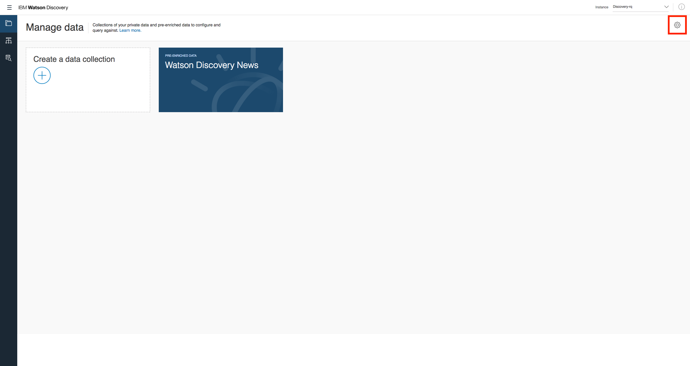
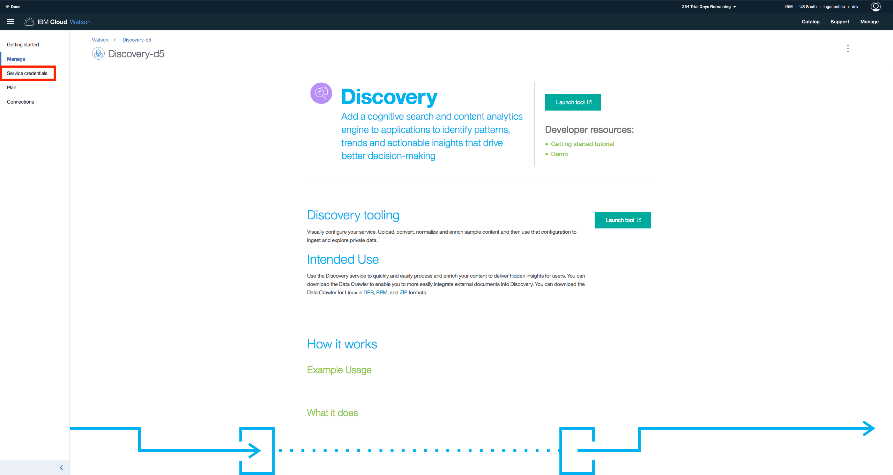

# Discovery Lab

**DEMO GIF HERE**

## Introduction
In this lab, you'll get the chance to try out the new Watson Salesforce SDK by integrating the Watson Discovery service into a Salesforce Lightning app. The app will _____. After completing the lab, you should be familiar with:

 - Instantiating a Watson service instance in IBM Cloud
 - Deploying the Watson Salesforce SDK to your Salesforce org
 - Integrating the Watson Discovery service into your Lightning app

 If throughout the lab you have any other questions, you can find more details about the Discovery service [here](https://www.ibm.com/watson/services/discovery/). Otherwise, let's get started!

## Setup
### IBM Cloud
To get started using any Watson service, you need to first create it and get the credentials in IBM Cloud. If you already have an IBM Cloud account, log in [here](https://console.bluemix.net/registration/?target=/catalog/services/discovery&cm_mmc=OSocial_Wechat-_-Watson+Core_Watson+Core+-+Platform-_-WW_WW-_-salesforce&cm_mmca1=000000OF&cm_mmca2=10000409&) to be taken straight to the Discovery service creation page. If you do not yet have an account, create one and follow the above link again after receiving the confirmation email.

Once you're at the service creation page, you can click "Create" on the bottom right to instantiate your Discovery service. 

Now that we have an instance, we're going to create an environment to hold our data collections.

Click the "Launch tool" button in the center of the screen to get to the Discovery tooling. Here is where you can upload documents in different collections to query.

First, you need to create an environment. You can do so by clicking on the gear icon at the top-right of the page.

When prompted to create a collection, go ahead and exit out of the prompt. We'll do that through the SDK later on. First though, we'll need to get things set up in our Salesforce environment.

### Salesforce
If you don't yet have a Salesforce developer environment, you'll need to [sign up](https://developer.salesforce.com/signup). Otherwise, [log in here](https://login.salesforce.com/).

Next, follow the instructions on the [Watson Salesforce SDK GitHub page]() - **need link** - README to deploy the SDK to your developer org. Automatic and manual deployment using Salesforce DX are both supported, as well as manual deployment using Ant.

Now, you should have all of the SDK classes loaded into your developer environment. The last piece of setup is adding your Conversation credentials to authenticate with the service. The preferred way to add these is using named credentials, and you can also find the instructions for this in the SDK README.

To find those credentials, navigate back to the IBM Cloud page shown below, where you launched the Conversation tooling earlier, and click on the "Service credentials" menu item:

From this page, click on the "New credential" button. Don't worry about filling in any extra information. You should now be able to view your new credential to get your username and password.

Now it's time to start using the SDK!

## Building the App
Add in base template for Lightning page. Walk through adding Conversation code, using SDK's `message` method. Tie back-end with Lightning page front-end for working conversation.

## Conclusion
Final words, maybe helpful links to check out for later.